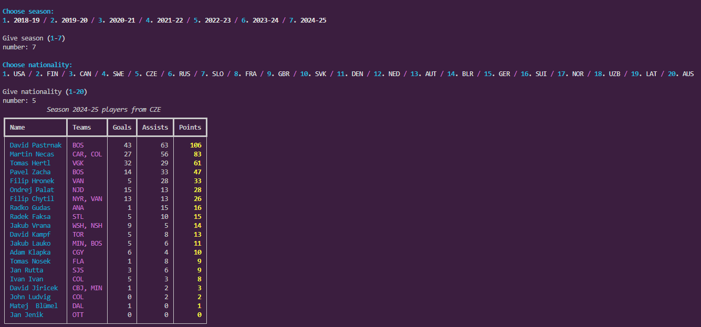
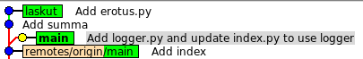
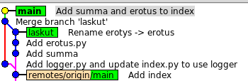

## viikko 2 

### Tehtävä 1 
- [X] Luo kansiot              
- [X] Poetry init --python "^3.12"            
- [X] Poetry add flask@latest             
- [X] Poetry add --group dev pytest             
- [X] Poetry run pytest --version  -> 8.4.2            
- [X] Poetry add sqlalchemy              
- [X] Poetry add "sqlalchemy==1.4.54"             
- [X] Poetry remove flask          
- [X] Poetry add fastapi               

### Tehtävä 2 
- [X] Poetry add requests                
- [X] Liitä index-runko             
- [X] Luo attribuutit player luokalle JSON-datasta             
- [X] Luo tulostus pelaajille             

### Tehtävä 3
- [X] Suodata suomalaiset pelaajat        
- [X] Järjestä pisteiden mukaan           
- [X] Muotoile tulostus      

### Tehtävä 4 
- [X] Luo PlayerReader ja PlayerStats        
- [X] Toteuta PlayerReader           
- [X] Toteuta PlayerStats         
- [X] Kytke uusi logiikka pääohjelmaan                    

### Tehtävä 5
- [X] Poetry add rich      
- [X] Luo valintavalikot        
- [X] Luo tulostustaulukko richillä valitun maan ja kauden pelaajille        



### Tehtävä 8 
- [X] Lisää pylint ja autopep8 projektiin           
- [X] Korjaa pylint virheet 
- [X] Bonus: Lisää pre-commit projektin juureen, joka suorittaa pylint-tarkistuksen alikansiolle nhl-reader             
````
  GNU nano 6.2                                                            .git/hooks/pre-commit                                                                     
#!/bin/bash
export PATH="$HOME/.local/bin:$PATH"

echo "🔍 Running Pylint for viikko2/nhl-reader project..."

# Siirrytään oikeaan hakemistoon, jossa pyproject.toml sijaitsee
cd "$(git rev-parse --show-toplevel)/viikko2/nhl-reader" || exit 1

# Tarkistetaan, että Poetry on asennettu
if ! command -v poetry &> /dev/null; then
    echo "❌ Poetry not found in PATH. Please install Poetry."
    exit 1
fi

# Aja pylint käyttäen Poetry-ympäristöä
poetry run pylint src
RESULT=$?

if [ $RESULT -ne 0 ]; then
    echo ""
    echo "❌ Commit cancelled — Pylint found issues in viikko2/nhl-reader."
    echo "Fix the issues and try committing again."
    exit 1
fi

echo "✅ Pylint passed successfully for viikko2/nhl-reader!"
exit 0

````                

### Tehtävä 9

- [X] Luo alihakemisto viikko2/git-branch-harjoitus          
- [X] Main-haarassa cd viikko2/git-branch-harjoitus         
- [X] Luo ja committaa hakemistoon tiedosto index.py          
- [X] git checkout -b laskut       
- [X] laskut-haarassa luo tiedosto summa.py        
- [X] laskut-haarassa lisää ja committaa summa.py versionhallintaan           
- [X] git checkout main              
- [X] Main-haarassa luo tiedosto logger.py          
- [X] Main-haarassa muokkaa tiedostoa  index.py         
- [X] main-haarassa committaa muutokset        
- [X] git checkout laskut       
- [X] laskut-haarassa lisää ja committaa tiedosto erotus.py         
- [X] git checkout main          
- [X] Asenna gitk         
- [X] Tarkastele gitk:lla git-puuta       
   
- [X] main-haarassa git merge laskut     
- [X] main-haarassa muuta tiedostoa index.py ja commitoi muutos    
- [X] Tarkastele gitk:lla git-puuta         



### Tehtävä 10
- [X] main-haarassa luo uusi tiedosto README.md
- [X] main-haarassa git status  
```` 
On branch main
Your branch is up to date with 'origin/main'.

Untracked files:
  (use "git add <file>..." to include in what will be committed)
        viikko2/git-branch-harjoitus/README.md
```` 
- [X] git checkout laskut   
- [X] laskut-haarassa git status  
```` 
On branch main
Your branch is up to date with 'origin/main'.

Untracked files:
  (use "git add <file>..." to include in what will be committed)
        viikko2/git-branch-harjoitus/README.md
```` 
- [X] laskut-haarassa lisää tiedosto nyt versionhallinnan alaisuuteen ja commitoi se        
- [X] laskut-haarassa luo uusi tiedosto LICENSE ja lisää se versionhallintaan, mutta älä commitoi        
- [X] laskut-haarassa git status  
````
On branch laskut
Changes to be committed:
  (use "git restore --staged <file>..." to unstage)
        new file:   viikko2/git-branch-harjoitus/LICENCE
````
- [X] git checkout main        
- [X] main-haarassa git status  
````  
On branch main
Your branch is up to date with 'origin/main'.

Changes to be committed:
  (use "git restore --staged <file>..." to unstage)
        new file:   viikko2/git-branch-harjoitus/LICENCE
````
- [X] main-haarassa committoi LICENSE        
- [X] main-haarassa git status           
````
On branch main
Your branch is ahead of 'origin/main' by 1 commit.
  (use "git push" to publish your local commits)

nothing to commit, working tree clean
````
- [X] git checkout laskut       
- [X] laskut-haarassa git merge main   
- [X] git checkout main    
- [X] git branch -d laskut    
git branch -d laskut
````
error: The branch 'laskut' is not fully merged.
If you are sure you want to delete it, run 'git branch -D laskut'.
````
- [X] git branch -D laskut 
```` 
Deleted branch laskut 
````    

### Tehtävä 11 
- [X] main-haarassa muokkaa index.py-tiedostoa alkua            
- [X] main-haarassa committaa muutos       
- [X] git checkout -b bugikorjaus       
- [X] bugikorjaus-haarassa editoi tiedoston index.py loppua
- [X] bugikorjaus-haarassa committaa index.py      
- [X] git checkout main       
- [X] main-haarassa muokkaa index.py-tiedostoa alkua         
- [X] main-haarassa committaa muutos       
- [X] git merge bugikorjaus       
- [X] main-haarassa muuta tiedoston index.py print-komentoja   
- [X] main-haarassa committaa muutos         
- [X] git checkout bugikorjaus       
- [X] bugikorjaus-haarassa muuta tiedoston index.py print-komentoja      
- [X] bugikorjaus-haarassa committaa index.py         
- [X] git merge main          
- [X] Ratkaise konflikti        
- [X] Lisää index.py staging alueelle ja committoi      

### Tehtävä 12
- [X] git checkout main      
- [X] git push              
- [X] git checkout bugikorjaus       
- [X] git push --set-upstream origin bugikorjaus         
- [X] Kloonaa GitHub-repositoriosta koneellesi toinen klooni       
- [X] kloonissa git branch        
`* main`         
- [X] kloonissa git switch -c bugikorjaus --track origin/bugikorjaus       
- [X] kloonissa git branch -vv           
````
bugikorjaus f1b6dd9 [origin/bugikorjaus] Resolve conflict in index.py
  main        0966664 [origin/main] Add ex11 documentation 
````
- [X] kloonissa Lisää “träkkäävään” branchiin tiedosto changelog.txt, committaa ja pushaa branch GitHubiin           
- [X] kloonissa git checkout -b tulo    
- [X] kloonissa Lisää tulo.py         
- [X] kloonissa Muokkaa index.py:tä ja commitoi ja pushaa se  `git push --set-upstream origin tulo`  
- [X] Mene GitHub-repositorion alkuperäiseen paikalliseen kopioon
- [X] git fetch  
````
From github.com:Tapir79/palautusrepositorio
   f1b6dd9..c4785dd  bugikorjaus -> origin/bugikorjaus
 * [new branch]      tulo        -> origin/tulo
````
- [X] git switch -c tulo --track origin/tulo    

- [X] git checkout main        
- [X] git merge tulo       
- [X] git branch -d tulo    
- [X] git push origin --delete tulo          
- [X] Lisää osamaara.py ja commitoi se        
- [X] git push --set-upstream origin osamaara       
- [X] Mene jälleen hetki sitten luotuun repositorion klooniin ja haaraan main   
- [X] git remote show origin

````
* remote origin
  Fetch URL: git@github.com:Tapir79/palautusrepositorio.git
  Push  URL: git@github.com:Tapir79/palautusrepositorio.git
  HEAD branch: main
  Remote branches:
    bugikorjaus              tracked
    main                     tracked
    osamaara                 new (next fetch will store in remotes/origin)
    refs/remotes/origin/tulo stale (use 'git remote prune' to remove)
  Local branches configured for 'git pull':
    bugikorjaus merges with remote bugikorjaus
    main        merges with remote main
    tulo        merges with remote tulo
  Local refs configured for 'git push':
    bugikorjaus pushes to bugikorjaus (up to date)
    main        pushes to main        (up to date)
````
- [X] git branch -D tulo   
- [X] git checkout osamaara          
- [X] git push            
- [X] git remote prune origin   
- [X] git fetch --all           
- [X] git remote show origin         
````      
* remote origin
  Fetch URL: git@github.com:Tapir79/palautusrepositorio.git
  Push  URL: git@github.com:Tapir79/palautusrepositorio.git
  HEAD branch: main
  Remote branches:
    bugikorjaus tracked
    main        tracked
    osamaara    tracked
  Local branches configured for 'git pull':
    bugikorjaus merges with remote bugikorjaus
    main        merges with remote main
    osamaara    merges with remote osamaara
  Local refs configured for 'git push':
    bugikorjaus pushes to bugikorjaus (up to date)
    main        pushes to main        (up to date)
    osamaara    pushes to osamaara    (up to date)
````

### Tehtävä 13   
- [X] Mene alkuperäisen repositorion paikallisen kloonin main-haaraan, tee tekstitiedosto, commitoi ja pushaa se GitHubiin        
- [X] Mene toisen kloonin main-haaraan ja tee sinne jokin muutos          
git push
````
To github.com:Tapir79/palautusrepositorio.git
 ! [rejected]        main -> main (fetch first)
error: failed to push some refs to 'github.com:Tapir79/palautusrepositorio.git'
hint: Updates were rejected because the remote contains work that you do
hint: not have locally. This is usually caused by another repository pushing
hint: to the same ref. You may want to first integrate the remote changes
hint: (e.g., 'git pull ...') before pushing again.
hint: See the 'Note about fast-forwards' in 'git push --help' for details.
````               
- [X] git pull   
- [X] git config pull.rebase true           
- [X] git pull      
- [X] git push           