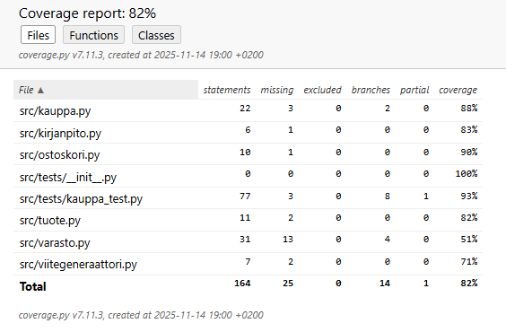
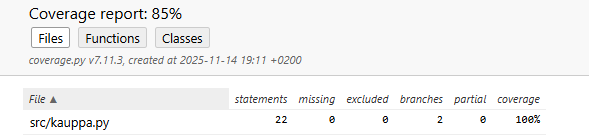
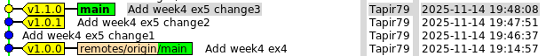

## viikko 4 

### Tehtävä 1 - Yksikkötestaus ja riippuvuudet: mock-kirjasto, osa 1
- [X] Käynnistä Python-terminaali komennolla python3:                       
- [X] Anna terminaaliin yksi kerrallaan samat syötteet kuin esimerkeissä ja suorita ne.    
- [X] Hae mock-demo projekti ja tutustu sen testeihin          
- [X] Riko yksi mock-demon testi ja tarkista virheilmoitus           
````
E           AssertionError: expected call not found.
E           Expected: maksa(<ANY>, <ANY>, 1000)
E             Actual: maksa('1111', 10, 2)

````   
- [X] Korjaa rikottu testi, älä pushaa koodia githubiin (git discard changes)        


### Tehtävä 2 - Yksikkötestaus ja riippuvuudet: mock-kirjasto, osa 2
- [X] Hae maksukortti-mock projekti        
- [X] Korjaa kassapäätteen metodi osta_lounas.       
- [X] Lisää testi: lataa kutsu lisää maksukortille ladattavan rahamäärän käyttäen kortin metodia lataa, jos ladattava summa on positiivinen     
- [X] Lisää testi: Kassapäätteen metodin lataa kutsu ei tee maksukortille mitään, jos ladattava summa on negatiivinen      
- [X] Korjaa kassapäätettä siten, että testit menevät läpi         

### Tehtävä 3 - Yksikkötestaus ja riippuvuudet: mock-kirjasto, osa 3         
- [X] Hae viikko4/verkkokauppa projekti      
- [X] Tutustu koodiin.        
- [X] Luo sekvenssikaavio index.pyn ensimmäisestä ostotapahtumasta:
````mermaid
sequenceDiagram
    participant Main
    participant Kauppa
    participant Ostoskori
    participant Varasto
    participant Viitegeneraattori
    participant Pankki
    participant Kirjanpito

    Main->>Kauppa: luodaan Kauppa(varasto, pankki, viitegeneraattori)

    Main->>Kauppa: aloita_asiointi()
    Kauppa->>Ostoskori: uusi Ostoskori()

    Main->>Kauppa: lisaa_koriin(1)
    Kauppa->>Varasto: hae_tuote(1)
    Kauppa->>Ostoskori: lisaa(tuote 1)
    Kauppa->>Varasto: ota_varastosta(tuote 1)
    Varasto->>Kirjanpito: "otettiin varastosta Koff Portteri"

    Main->>Kauppa: lisaa_koriin(3)
    Kauppa->>Varasto: hae_tuote(3)
    Kauppa->>Ostoskori: lisaa(tuote 3)
    Kauppa->>Varasto: ota_varastosta(tuote 3)
    Varasto->>Kirjanpito: "otettiin varastosta Sierra Nevada Pale Ale"

    Main->>Kauppa: lisaa_koriin(3)
    Kauppa->>Varasto: hae_tuote(3)
    Kauppa->>Ostoskori: lisaa(tuote 3)
    Kauppa->>Varasto: ota_varastosta(tuote 3)
    Varasto->>Kirjanpito: "otettiin varastosta Sierra Nevada Pale Ale"

    Main->>Kauppa: poista_korista(1)
    Kauppa->>Ostoskori: poista(tuote 1)
    Kauppa->>Varasto: palauta_varastoon(tuote 1)
    Varasto->>Kirjanpito: "palautettiin varastoon Koff Portteri"

    Main->>Kauppa: tilimaksu("Pekka Mikkola", "1234-12345")
    Kauppa->>Viitegeneraattori: uusi()
    Viitegeneraattori-->>Kauppa: viite = 2
    Kauppa->>Ostoskori: hinta()
    Ostoskori-->>Kauppa: summa = 10
    Kauppa->>Pankki: tilisiirto("Pekka Mikkola", viite=2, tililtä="1234-12345", tilille="33333-44455", summa=10)
    Pankki->>Kirjanpito: "tilisiirto: 1234-12345 → 33333-44455, viite 2, 10e"
    Pankki-->>Kauppa: True
```` 


- [X] poetry install       
- [X] poetry run pytest (1 testi PASS)
- [X] Uusi testi: Aloitetaan asiointi, koriin lisätään tuote, jota varastossa on ja suoritetaan ostos, eli kutsutaan metodia kaupan tilimaksu, varmista että kutsutaan pankin metodia tilisiirto oikealla asiakkaalla, tilinumeroilla ja summalla           
- [X] Uusi testi: Aloitetaan asiointi, koriin lisätään kaksi eri tuotetta, joita varastossa on ja suoritetaan ostos, varmista että kutsutaan pankin metodia tilisiirto oikealla asiakkaalla, tilinumerolla ja summalla          
- [X]  Uusi testi: Aloitetaan asiointi, koriin lisätään kaksi samaa tuotetta, jota on varastossa tarpeeksi ja suoritetaan ostos, varmista että kutsutaan pankin metodia tilisiirto oikealla asiakkaalla, tilinumerolla ja summalla          
- [X] Uusi testi: Aloitetaan asiointi, koriin lisätään tuote, jota on varastossa tarpeeksi ja tuote joka on loppu ja suoritetaan ostos, varmista että kutsutaan pankin metodia tilisiirto oikealla asiakkaalla, tilinumerolla ja summalla            


### Tehtävä 4 - Yksikkötestaus ja riippuvuudet: mock-kirjasto, osa 4         
- [X] Uusi testi: metodin aloita_asiointi kutsuminen nollaa edellisen ostoksen tiedot          
- [X] Uusi testi: kauppa pyytää uuden viitenumeron jokaiselle maksutapahtumalle     
- [X] poetry add coverage --group dev     
- [X] coverage report aloitustilanne kauppa 88%:   
       
- [X] Uusi testi: korista poistaminen (ei havaittuja bugeja)           
- [X]  coverage report testin jälkeen kauppa 100%:   
             
              
### Tehtävä 5 - git: tägit      
- [X] Lue  http://git-scm.com/book/en/v2/Git-Basics-Tagging     
- [X] Luo lightweight tag `git tag v1.0.0`     
- [X] `git push origin v1.0.0`   
- [X] Tarkista tag paikallisesti: git tag     
- [X] Tarkista tag githubista      
- [X] Tee kolme committia (eli 3 kertaa muutos + add + commit)     
- [X] Luo lightweight tag `git tag v1.1.0`  
- [X] Katso gitk-komennolla miltä historiasi näyttää     
      
- [X] `git checkout v1.0.0`      
- [X]  tagin jälkeisiä muutoksia ei näy       
- [X] `git checkout main`         
- [X] Lisää tägi edelliseen committiin `git tag v1.0.1 HEAD^`   
  
- [X] `git push origin v1.1.0`      
- [X] `git push origin v1.0.1` (`git push --tags`)        
